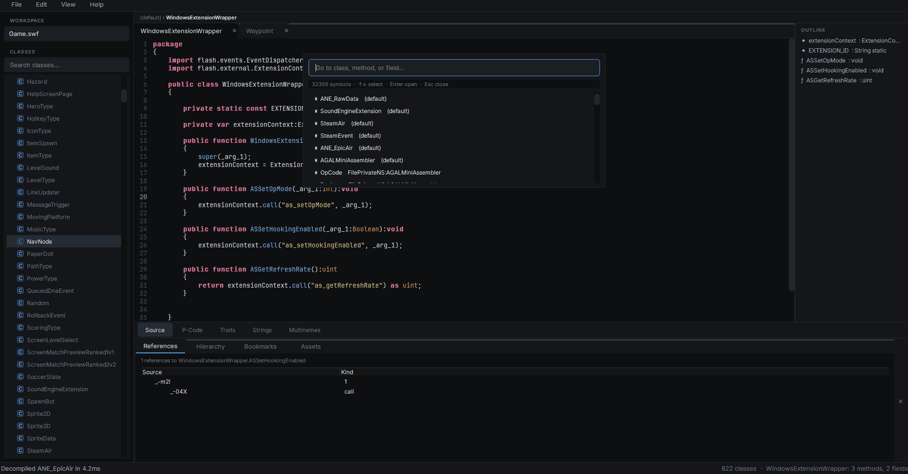

# flashkit-studio

<p>
  
  
  
  
</p>

Desktop SWF inspector for Adobe Flash files and AVM2 bytecode. Browse classes, recover AS3 source, trace references, and explore the constant pool.

Built on [flashkit](https://github.com/bitalizer/pyflashkit) using PySide6 (Qt 6).

<p align="center">
  
</p>

## Features

- **Class browser** — sidebar tree grouped by package, with class glyphs and a fuzzy filter that matches member names too.
- **AS3 source view** — full decompiled output with syntax highlighting, line numbers, and find-in-file.
- **P-Code view** — AVM2 disassembly with resolved operands.
- **Strings, Multinames, Traits** views with filter inputs.
- **Symbol palette** — `Ctrl+P` fuzzy search for classes, methods, fields across the whole SWF.
- **Find in files** — `Ctrl+Shift+F` greps decompiled source across all classes, results grouped by class.
- **Jump to definition** — `Ctrl+click` or `F12` on an identifier; works on obfuscated names too.
- **Outline pane** — fields and methods of the active class, click to scroll to definition.
- **Bottom panel** with tabs for **References**, **Class hierarchy**, **Bookmarks** (`Ctrl+B`), and **Assets** (extract embedded bitmaps / sounds / fonts).
- **Recent SWFs** menu, drag-and-drop to open, persistent window state and sidebar side.

## Install

```bash
pip install flashkit-studio
```

Then launch:

```bash
flashkit-studio
# or
python -m flashkit_studio
```

Requires Python 3.10+. Pulls `pyflashkit>=1.3.0` and `PySide6>=6.5` automatically.

### From source

```bash
git clone https://github.com/bitalizer/flashkit-studio.git
cd flashkit-studio
pip install -e .
```

## Keyboard shortcuts

| Shortcut | Action |
| --- | --- |
| `Ctrl+O` | Open SWF |
| `Ctrl+P` | Go to symbol (palette) |
| `Ctrl+F` | Find in current view |
| `Ctrl+Shift+F` | Find in all files |
| `Ctrl+G` | Go to line |
| `F12` / `Ctrl+click` | Jump to definition |
| `Ctrl+B` | Toggle bookmark on current line |
| `Ctrl+W` | Close active tab |
| `Ctrl+Shift+W` | Close current SWF |
| `F3` / `Shift+F3` | Find next / previous |

## License

MIT
